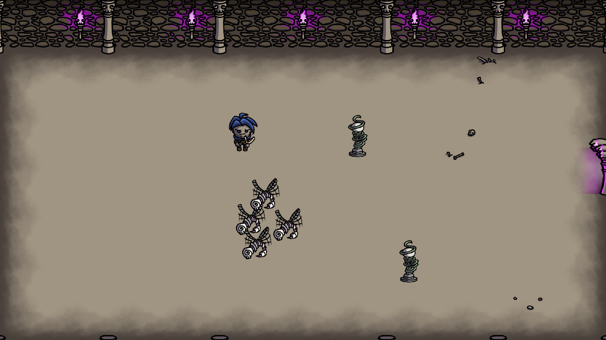
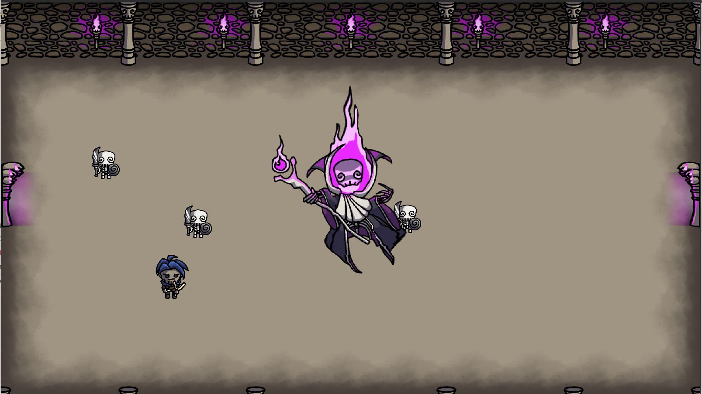

# Hippopotamus

**Hippopotamus** - некоммерческая 2D игра в жанре «rogue-like», написанная на
C++ с использованием
[Qt Framework](https://www.qt.io) и концепции Entity Component System.

Игра является учебным проектом студентов 5 группы 1 курса Факультета Прикладной
Математики и Информатики БГУ (2 семестр 2020-2021)

Участники команды:

* Егор Ходасевич ([@Khody31](https://github.com/Khody31))
* Полина Черникова ([@polchernikova](https://github.com/polchernikova))
* Николай Гопоняко ([@NikolaiNick](https://github.com/NikolaiNick))
* Владислав Кощенко ([@Koshchanka](https://github.com/Koshchanka))

Менторы:

* Максим Мясоеденков([@ternerss](https://github.com/ternerss))
* Владимир Кузьмицкий([@VKuzia](https://github.com/VKuzia))

Любимый иллюстратор:

* Герман Нестер([@Xijiks](https://github.com/Xijiks))

## Описание игры

Главным героем в игре является путешественник, таинственным образом оказавшийся
в магическом подземелье. Чтобы выбраться, он должен найти и одолеть всех боссов,
оставшись при этом в живых.

|  |
| ---------------------------------- |

|  | 
| ---------------------------------- |

## Статус разработки

Разработка игры была начата в марте 2021 года.

В папке releases находятся исполняемые файлы программы. С их помощью вы сможете
запустить приложение на 64-битной Windows. Также вы можете скомпилировать проект
на другой ОС, предварительно клонировав репозиторий.

Чтобы запустить приложение на Windows, запустите исполняемый файл
hippopotamus.exe.

## Continuous integration

После каждого нового коммита запускается автоматическая сборка и статический
анализ кода проекта. Обычно это занимает примерно две минуты. Ссылки на результат и
логи процесса доступны на [странице GitHub Actions](https://github.com/Khody31/hippopotamus/actions),
а также в статусе коммита в списке коммитов.

Замечания `cppcheck` (на стадии *check*) не влияют на статус CI (из-за большого
количества ложноположительных срабатываний), но рекомендуется все же обращать
на них внимание. Предупреждения `cpplint` на стадии *check* и ошибки при сборке
на стадии *build* влияют на статус CI, и игнорировать их нельзя.

## Сборка проекта с помощью CMake

Если вы хотите собрать проект в среде разработки Clion, вам для начала
необходимо клонировать репозиторий.

Далее для корректной работы скрипта необходимо указать путь к соответствующим
библиотекам Qt на своем компьютере (установить соответствующее значение
переменной `CMAKE_PREFIX_PATH`). Для этого в CMake-скрипте необходимо добавить
строку `set(CMAKE_PREFIX_PATH "~/Qt/5.15.2/gcc_64/lib/cmake)` на Linux 
или `set(CMAKE_PREFIX_PATH "C:/Qt/Qt5.13.0/5.13.0/mingw73_64/lib/cmake")` на Windows.

После этого на Linux проект можно импортировать в CLion для дальнейшей работы.
Под Windows необходимы дополнительные действия. Нужно указать в *Path*
путь к компилятору в составе Qt, а также путь к библиотекам Qt. Например:

`C:\Qt\Tools\mingw810_64\bin`

`C:\Qt\5.15.2\mingw81_64\bin`

После внесения изменений в *Path* необходимо перезагрузить Windows. Далее
рекомендуется выбрать в CLion компилятор, входящий в состав Qt (указать путь к
нему в **Settings - Toolchains**). После этого можно работать с проектом.
