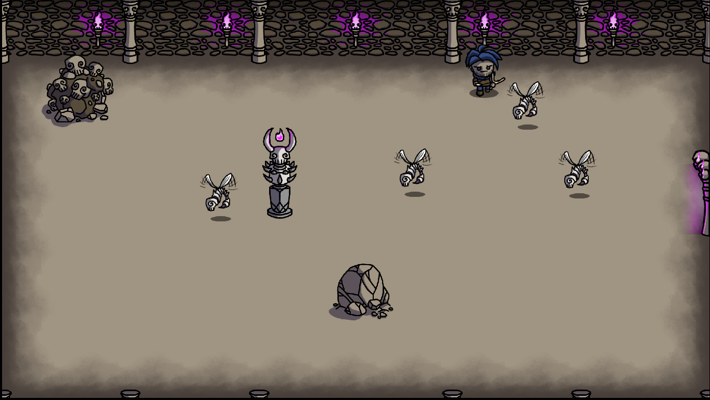
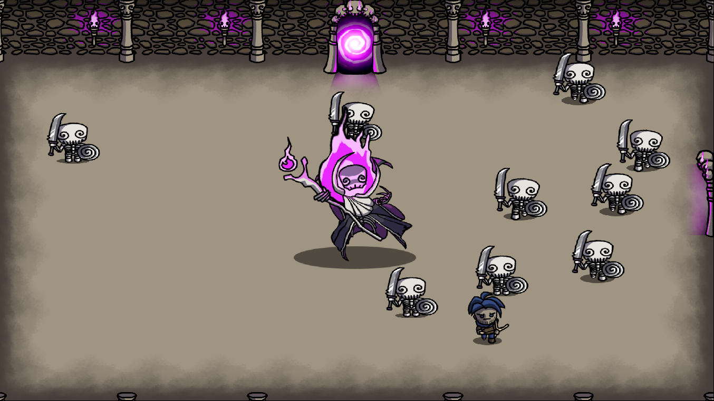

# Hippopotamus

**Hippopotamus** - некоммерческая 2D игра в жанре «rogue-like», написанная на C++ с использованием
[Qt Framework](https://www.qt.io).

Игра является учебным проектом студентов 5 группы 1 курса Факультета Прикладной Математики и Информатики БГУ (2 семестр 2020-2021)

Участники комманды:
* Егор Ходасевич ([@Khody31](https://github.com/Khody31))
* Полина Черникова ([@polchernikova](https://github.com/polchernikova))
* Николай Гопоняко ([@NikolaiNick](https://github.com/NikolaiNick))
* Владислав Кощенко ([@Koshchanka](https://github.com/Koshchanka))

Менторы: 
* Максим Мясоеденков([@ternerss](https://github.com/ternerss))
* Владимир Кузьмицкий([@VKuzia](https://github.com/VKuzia))

Любимый иллюстратор:
* Герман Нестер

## Описание игры
Главным героем в игре является путешественник, таинственным образом оказавшийся в 
магическом подземелье. Чтобы выбраться, он должен найти и одолеть всех боссов, оставшись при этом в живых. 

|  |
| ---------------------------------- |

|  | 
| ---------------------------------- |

## Статус разработки
Разработка игры была начата в марте 2021 года.

В папке releases находятся исполняемые файлы программы. С их помощью вы
сможете запустить приложение на 64-битной Windows. Также вы можете
скомпилировать проект на другой ОС, предварительно клонировав репозиторий.

Чтобы запустить приложение на Windows, запустите исполняемый файл hippopotamus.exe.

## Сборка проекта с помощью CMake
Если вы хотите собрать проект в среде разработки Clion, вам для начала
необходимо склонировать репозиторий.
В зависимости от того, на какой операционной системе вы работаете, вам стоит
прописать одну из следующих строчек в файле CMakeLists.txt:
* `set(CMAKE_PREFIX_PATH "~/Qt/5.13.2/gcc_64/lib/cmake")  # Linux`
* `set(CMAKE_PREFIX_PATH "C:/Qt/Qt5.13.0/5.13.0/mingw73_64/lib/cmake") # Windows`

После этого остается только запустить сборку проекта.
